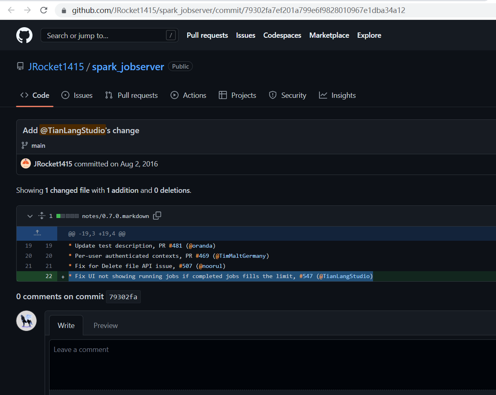
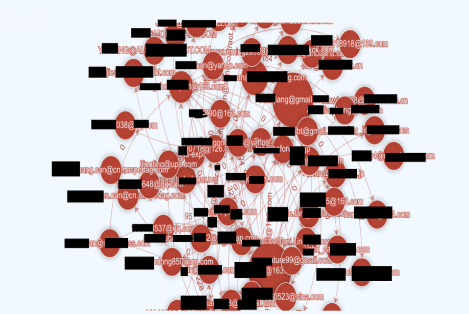
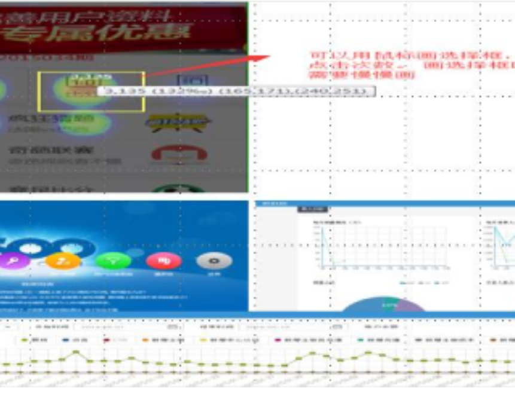
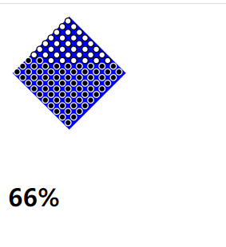
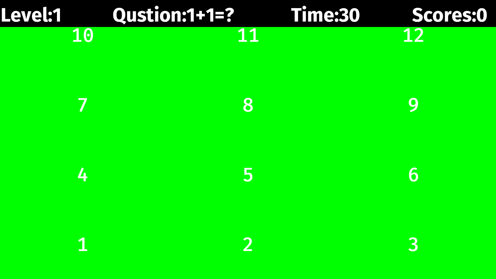
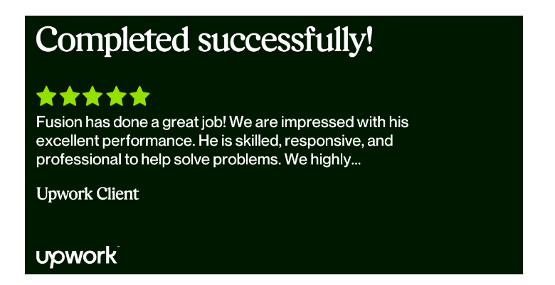

# Hi there 👋

Hello, Glad to meet you. I'm [Fusion Zhu](https://www.upwork.com/fl/huanqingzhu), 
a Full-stack development with experience in Java, JavaScript, Bigdata, and Rust.  
Yep, I just like to learn new techniques.  

## Projects I did or participated in on GitHub:  
  ### Big Data  
  [DataXServer Distributed ETL  Hadoop Kafka Java Scala](https://github.com/TianLangStudio/DataXServer)  
  [Databend Distributed Warehouse Rust](https://github.com/TianLangStudio/databend)  
  [Spark JobServer Scala](https://github.com/spark-jobserver/spark-jobserver)  
    
  [Email Analysis Clickhouse ElasticSearch D3.js Java JavaScript](https://github.com/TianLangStudio/email_analysis)  
  
    
  ### Data Visualization  
  [Charts D3.js echarts JavaScript](https://github.com/TianLangStudio/charts) 
    
  [ModelShow Clickhouse Spark React Java JavaScript](https://github.com/TianLangStudio/modelshow)  
  [excel-column-letter2num NodeJs JavaScript](https://github.com/TianLangStudio/excel-column-letter2num)  
  ### Application  
  [Win On GitHub Desktop Tauri React NextJs Rust JavaScript](https://github.com/TianLangStudio/WinOnGithub)  
  [TlPortal Web Spring ReactJS Java JavaScript](https://github.com/TianLangStudio/tlportal-frontend)  
  [Make Image As Map React Rust JavaScript](https://github.com/TianLangStudio/image_map_path)  
  ### Game 
  [PengPengQiu NodeJs Html5 websocket JavaScript](https://github.com/TianLangStudio/pengpengqiu)  
  [Pingpang Piston Rust](https://github.com/TianLangStudio/game_pingpang_rust)  
  [Arithmetic Bevy Rust](https://github.com/TianLangStudio/bevy_arithmetic)  
    
  ### Other  
  [Sokoban Game Book Translation Rust](https://github.com/TianLangStudio/rust-sokoban)
  
  
- 👨‍💼 I currently work in Shenzhen,China.
- 🏴󠁧󠁢󠁥󠁮󠁧󠁿 I currently learn English.
- 📺 I currently continue to make some [videos](https://www.ixigua.com/home/109529239261) about learning programming. 
- 👯 I look for cooperation opportunities on [Upwork](https://www.upwork.com/fl/huanqingzhu).
  

<!--
- 👯 I’m looking to collaborate on ...
- 🤔 I’m looking for help with ...
- 💬 Ask me about ...
- 📫 How to reach me: ...
- 😄 Pronouns: ...
- ⚡ Fun fact: ...
-->

